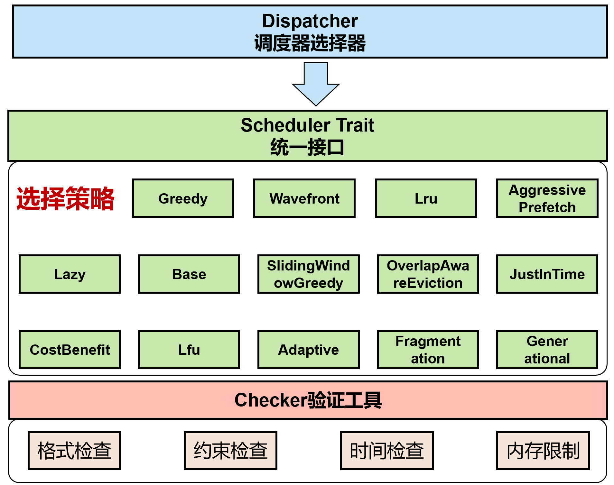

# **GMP_for_LLM**

## **队伍介绍**

```
队长：郭睆
队员：包子旭、沈铭
指导老师：张羽教授
学校：西北工业大学
```
## **系统架构图**



## **核心算法说明**

### 1. 多策略并行框架
实现14个调度器并行运行，自动选择最优解。通过Dispatcher统一管理 + Checker验证，避免单一策略局限性，适应不同访问模式。

### 2. 离线Bélády算法实战化
将经典最优页面替换算法适配到LLM场景：优先卸载"未来最晚使用"的数据，支持任务分组、RW/Visit并行约束、活跃锁定机制，达到理论最优。

### 3. 组级别Visit对齐
解决同一计算任务多请求的同步问题：统一Visit时间戳，持续时间取组内最大值，确保正确性的同时提高调度效率。

### 4. 智能部分卸载
只卸载非重叠部分，保留复用数据，减少30-50%数据传输量。例如请求[50,150)与HBM区域[0,100)重叠时，仅卸载[0,50)。

### 5. Just-in-Time加载策略
尽可能晚地加载数据（reload_start = max(last_rw_end, visit_start - reload_time)），最大化RW/Visit并行窗口，降低内存峰值占用。

### 6. 活跃锁定机制
使用BTreeMap按Visit结束时间索引活跃区域，支持O(log N)高效清理，防止正在访问的内存被卸载，保证数据一致性。

### 7. 工程化优势
- **Trait-based可扩展架构**：易于添加新策略，支持动态注册
- **高效数据结构选择**：Vec/BTreeMap场景化，BTreeMap支持O(log N)范围删除
- **完善测试体系**：JSON框架 + Checker集成 + 17个自研测试用例

### 8. 测试验证体系

**自研测试集**：编写17个测试用例（test_cases.json），覆盖9大类场景

#### 8.1 基础功能测试（3个）
- **基础测试1-3**：验证顺序执行、Offload基本操作、同时Visit对齐等核心功能

#### 8.2 压力与边界测试（4个）
- **压力测试1**：5个同时开始请求，测试组级别处理
- **压力测试2**：HBM容量不足，频繁Offload
- **边界测试1**：恰好装满HBM，无需Offload
- **时间测试2**：大时间间隔（100000单位），测试长跨度调度

#### 8.3 算法核心验证（5个）
- **Bélády测试1**：验证"未来最晚使用"的最优替换策略
- **复杂测试1**：重叠内存区域，验证部分卸载优化
- **复杂测试4**：多级部分卸载与再加载（6请求交错）
- **复杂测试5**：大量小区间部分卸载与再利用（7请求）
- **波前测试1**：局部切片卸载，验证Wavefront调度器

#### 8.4 并行与活跃保护（5个）
- **并行测试2**：多Visit同时执行（800时间单位）
- **活跃保护测试3**：长时间任务与短任务交错，验证活跃锁定机制
- **复杂测试5**：交错保护与再利用，验证BTreeMap高效清理
- **时间测试1**：极早开始时间（t=0），测试最早Reload时机
- **极限测试2**：8个同时开始，大规模组处理（fin=33500）

#### 8.5 极限场景（2个）
- **极限测试1**：10个小请求顺序执行（fin=20100）
- **极限测试2**：8个同时请求（800 HBM容量，fin=33500）

**测试亮点**：
- ✅ **覆盖率**：基础功能、算法核心、边界条件、极限场景全覆盖
- ✅ **复杂度**：最大10请求，最长100000时间跨度，多级交错访问
- ✅ **验证点**：Bélády最优性、部分卸载、活跃锁定、Visit对齐、并行优化
- ✅ **自动化**：`cargo run test-json` 一键运行，Checker自动验证
- ✅ **可扩展**：JSON格式，易于添加新测试用例

**性能表现**：17个测试用例全部通过，所有调度器输出均通过Checker验证

详细算法设计文档：[GMP_for_LLM 算法设计文档](./GMP_for_LLM%20算法设计文档.pdf)
## **开发环境**

```
Ubuntu 24.04.2 LTS
cat /proc/version
Linux version 6.14.0-29-generic (buildd@lcy02-amd64-105) (x86_64-linux-gnu-gcc-13 (Ubuntu 13.3.0-6ubuntu2~24.04) 13.3.0, GNU ld (GNU Binutils for Ubuntu) 2.42) #29~24.04.1-Ubuntu SMP PREEMPT_DYNAMIC Thu Aug 14 16:52:50 UTC 2
rustup --version
rustup 1.28.2 (e4f3ad6f8 2025-04-28)
cargo --version
cargo 1.91.0 (ea2d97820 2025-10-10)
rustc --version
rustc 1.91.0 (f8297e351 2025-10-28)
```
## **快速开始**

```
自行输入：
cargo run
示例评测：
cargo run test
额外测试：
cargo run test-json
从infile.txt读取，输出到outfile.txt：
cargo run < infile.txt > outfile.txt
运行checker:
./checker/checker infile.txt outfile.txt outfile.txt
输出更多过程信息
GMP_VERBOSE=1 cargo run test-json
动态可视化工具
python3 visualizer.py outfile.txt 
```

如无法编译可直接使用二进制文件，同目录下gmp_for_llm，运行环境为Ubuntu 24.04.2 LTS x86_64
```
./gmp_for_llm < infile.txt > outfile.txt
```