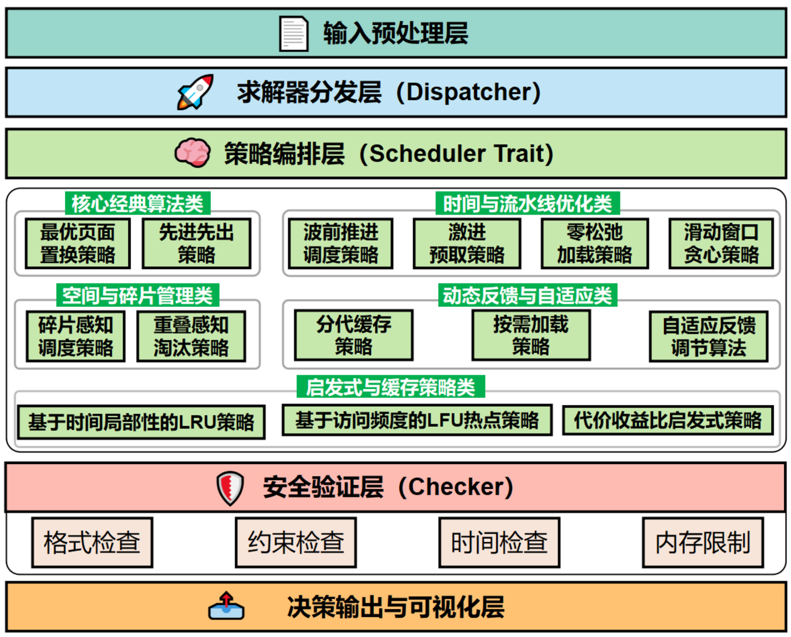

# **MemoRace系统架构：基于多策略竞速的元调度框架**

## **队伍介绍**

```
队长：郭睆
队员：包子旭、沈铭
指导老师：张羽教授
学校：西北工业大学
```
## **系统架构图**



## **系统技术总结**

1. 深入理解 LLM 推理中 HBM 内存管理问题，掌握 Reload/Offload 调度策略设计原理
2. 使用 Rust 系统编程实现 4000+ 行基于多策略竞速的元调度框架
3. 实现 14 种调度算法（Greedy/CostBenefit 等），完成性能对比与算法优化分析
4. 构建完整测试框架，集成 C++ checker 自动化评测系统，验证调度算法正确性
5. 开发动态可视化工具，直观展示虚拟地址加载至 HBM 物理空间变化过程

## **开发环境**

```
Ubuntu 24.04.2 LTS
cat /proc/version
Linux version 6.14.0-29-generic (buildd@lcy02-amd64-105) (x86_64-linux-gnu-gcc-13 (Ubuntu 13.3.0-6ubuntu2~24.04) 13.3.0, GNU ld (GNU Binutils for Ubuntu) 2.42) #29~24.04.1-Ubuntu SMP PREEMPT_DYNAMIC Thu Aug 14 16:52:50 UTC 2
rustup --version
rustup 1.28.2 (e4f3ad6f8 2025-04-28)
cargo --version
cargo 1.91.0 (ea2d97820 2025-10-10)
rustc --version
rustc 1.91.0 (f8297e351 2025-10-28)
```
## **快速开始**

```
自行输入：
cargo run
示例评测：
cargo run test
额外测试：
cargo run test-json
从infile.txt读取，输出到outfile.txt：
cargo run < infile.txt > outfile.txt
运行checker:
./checker/checker infile.txt outfile.txt outfile.txt
输出更多过程信息
GMP_VERBOSE=1 cargo run test-json
动态可视化工具
python3 visualizer.py outfile.txt 
```

如无法编译可直接使用二进制文件，同目录下gmp_for_llm，运行环境为Ubuntu 24.04.2 LTS x86_64
```
./gmp_for_llm < infile.txt > outfile.txt
```